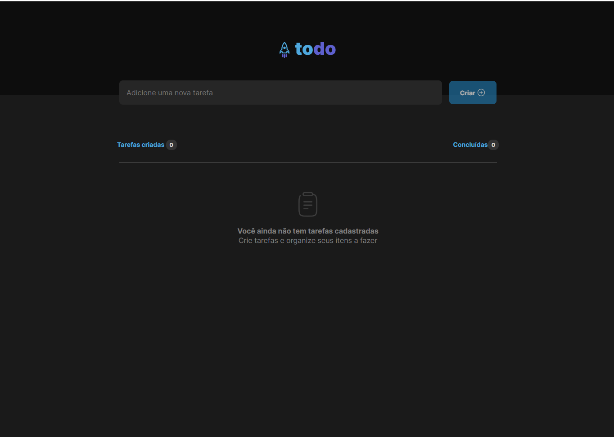

# Desafio 01 - Ignite Módulo ReactJS 

<h1 align="center">
    
</h1>

<h4 align="center"> 
	🚧  Todo List *** Concluído *** 🚧
</h4>

<p align="center">
 <a href="#-sobre-o-projeto">Sobre</a> •
 <a href="#-funcionalidades">Funcionalidades</a> •
 <a href="#-layout">Layout</a> • 
 <a href="#-como-executar-o-projeto">Como executar</a> • 
 <a href="#-tecnologias">Tecnologias</a> • 
 <a href="#-autor">Autor</a> • 
 <a href="#user-content--licença">Licença</a>
</p>


## 💻 Sobre o projeto

Primeiro desafio da trilha de **ReactJS** do **Ignite**. 

Nesse desafio foi reforçado os **conceitos mais importantes** do ReactJS e que serão utilizados em todas as aplicações que serão desenvolvidas no futuro.


---


## ⚙️ Funcionalidades

- [x] Adicionar uma nova tarefa.
- [x] Marcar e desmarcar uma tarefa como concluída.
- [x] Remover uma tarefa da listagem.
- [x] Mostrar o progresso de conclusão das tarefas.


---


## 🎨 Layout

O layout da aplicação está disponível no Figma:

<a href="https://www.figma.com/file/0n0zDN7zbzhRbaEO74Xesx/ToDo-List/duplicate">
  
</a>


---


## 🚀 Como executar o projeto

### Pré-requisitos

Antes de começar, você vai precisar ter instalado em sua máquina as seguintes ferramentas:
[Git](https://git-scm.com), [Node.js](https://nodejs.org/en/). 
Além disto é bom ter um editor para trabalhar com o código como [VSCode](https://code.visualstudio.com/)

#### 🎲 Rodando a aplicação

```bash
# Clone este repositório
$ git clone git@github.com:jhscavalcante/rs-ignite-reactjs-challenge-01.git
# Acesse a pasta do projeto no terminal/cmd
$ cd rs-ignite-reactjs-challenge-01
# Instale as dependências
$ npm i
# Execute a aplicação em modo de desenvolvimento
$ npm run dev
# O servidor será iniciado na porta:5173 - acesse http://localhost:5173 
```


---


## 🛠 Tecnologias

As seguintes ferramentas foram usadas na construção do projeto:

#### **Website**  

-   **([React](https://reactjs.org/)  +  [TypeScript](https://www.typescriptlang.org/))**
-   **[React Router Dom](https://github.com/ReactTraining/react-router/tree/master/packages/react-router-dom)**
-   **[Uuid](https://github.com/uuidjs/uuid#readme)**
-   **[Phosphor React](https://github.com/phosphor-icons/homepage)**
-   **[Vite](https://github.com/vitejs/vite/tree/main/#readme)**
-   **[Vitejs](https://github.com/vitejs/vite-plugin-react/tree/main/packages/plugin-react#readme)**
> Veja o arquivo  [package.json](https://github.com/jhscavalcante/rs-ignite-reactjs-challenge-01/blob/main/package.json)


#### **Utilitários**

-   Protótipo:  **[Figma](https://www.figma.com/)**  →  **[Protótipo (TodoList)](https://www.figma.com/file/0n0zDN7zbzhRbaEO74Xesx/ToDo-List/duplicate)**
-   Editor:  **[Visual Studio Code](https://code.visualstudio.com/)**  → Extensions:  **[CSS Modules](https://github.com/clinyong/vscode-css-modules)**
-   Fontes:  **[Inter](https://fonts.google.com/specimen/Inter)**


---


## Autor

 

[](https://www.linkedin.com/in/jhscavalcante/) 
[](mailto:hcavalcante1000@gmail.com)

---

## 📝 Licença

Este projeto esta sobe a licença [MIT](./LICENSE).

Feito por Henrique Cavalcante 👋🏽 [Entre em contato!](https://www.linkedin.com/in/jhscavalcante/)

---


